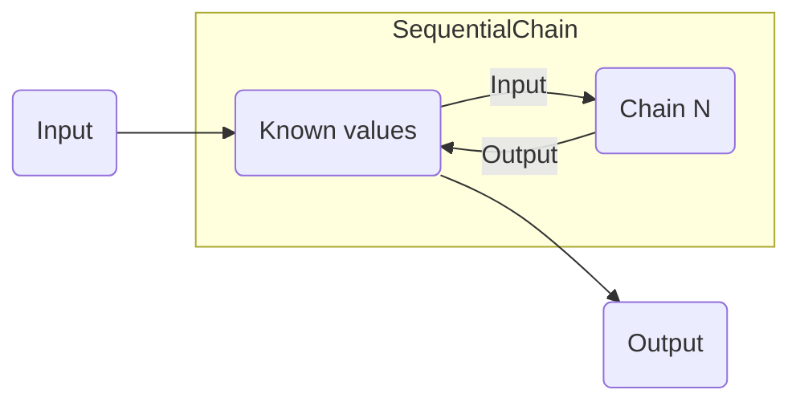

# Sequential Chain

The sequential chain allows you to connect multiple chains in sequence. This is useful when you, for instance, want to create more complex workflows involving one or more language models.

Once you call `process()` on the sequential chain, it will add the provided input to a collection of "known values." It then cycles through each of the nested chains in sequence. For each chain in the sequence, it calls the process method with all the known values. It then collects the output and adds that to the known values as well, before continuing on to the next chain in the sequence.

Once it has cycled through all the chains, it will return the output of the last chain as the final output.



## Input validation

Upon instantiation SequentialChain will check if any of the required inputs of nested chains are provided as outputs by any preceding chains. A `Vexo\Chain\SorryValidationFailed` exception will be thrown if that's not the case. It is important that any required inputs by a nested chain is properly defined, as well as any outputs that are needed by subsequent chains.

## Output values

By default SequentialChain will return the output of the last executed chain. You can override this by explictly providing the keys of known values in the `outputKeys` constructor argument. Alternatively, you can set `outputAll` to `true` to simply have it output all known values.

## Example

The example below creates a simple two-step workflow where we have a language model summarize the contents of a webpage.

```php
use Vexo\Chain\Chains;
use Vexo\Chain\Input;
use Vexo\Chain\LanguageModelChain;
use Vexo\Chain\SequentialChain;
use Vexo\Chain\WebTextChain;
use Vexo\LanguageModel\OpenAIChatLanguageModel;
use Vexo\LanguageModel\Response;
use Vexo\Prompt\BasicPromptTemplate;

// Create our WebTextChain which will retrieve the text from a webpage
$webTextChain = new WebTextChain(
    inputKey: 'url',
    outputKey: 'webpage-contents'
);

// Create our LanguageModelChain which will be responsible for creating the summary
$languageModelChain = new LanguageModelChain(
    languageModel: new OpenAIChatLanguageModel(
        \OpenAI::client(getenv('OPENAI_API_KEY'))->chat()
    ),
    promptTemplate: new BasicPromptTemplate(
        "Please summarize the following text:\n\n{{webpage-contents}}",
        ['webpage-contents']
    ),
    inputKeys: ['webpage-contents'],
    outputKey: ['summary']
);

// Finally create the sequential chain tying it all together
$webpageSummarizer = new SequentialChain(
    new Chains([$webTextChain, $languageModelChain]),
    inputKeys: ['url'],
    outputKeys: ['summary']
);

// Call the chain to summarize a webpage
$output = $webpageSummarizer->process(
    new Input(['url' => 'https://example.com'])
);

// Outputs something like: The text describes a domain that can be used in illustrative...
echo $output['summary'];
```
